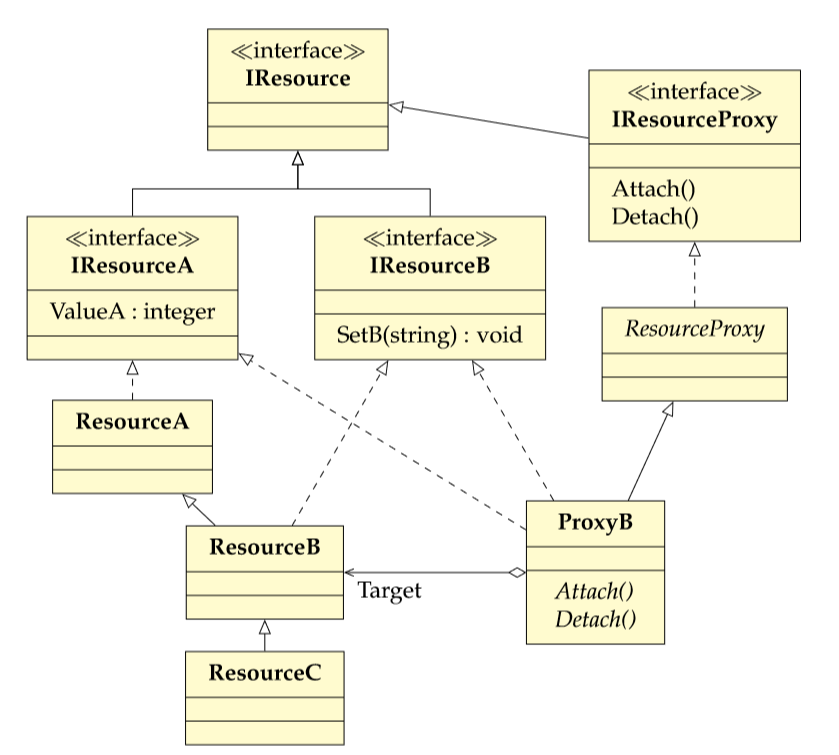

# Resource management

The new resources management also changes the way other modules interact with resources. 
The API offers direct access to all of the resource methods, properties and events as long as they are declared through an interface derived from [IPublicResource](xref:Moryx.AbstractionLayer.Resources.IPublicResource). 
Public resources with [NullCapabilities](xref:Moryx.AbstractionLayer.Capabilities.NullCapabilities), the null object implementation of [ICapabilities](xref:Moryx.AbstractionLayer.Capabilities.ICapabilities), are considered non-public. 
Users of the resource management can resolve instances by type, name or capabilities over the [Facade](xref:Moryx.Resources.Management.Facades.ResourceManagementFacade).

```cs
// Get by name
var res = Facade.GetResource<IMyResource>("Some");
// Get by capabilities
res = Facade.GetResource<IMyResource>(new MyCapabilities ());
// Get all
var all = Facade.GetResources<IMyResource>();
// Get filtered
all = Facade.GetResources<IMyResource>(r => r . Id > 42);
```

The API and interaction is decoupled from the resource graph. The user code resolves a single instance or list of instances to work with, but never the whole graph. 
This seems like a limitation at first, but it ensures structure independent user code limited to the interface of each resource and the capabilities to distinguish instances of the same interface. 
For example, the underlying system's structure can be as simple as a single, manually operated resource or a completely automatic working system of resources composed of different devices, utility providers, etc.
There could even be an underlying redundant architecture.
In all cases, the module responsible for mapping `Activities` to `Resources` always sees an enumeration of [IPublicResource](xref:Moryx.AbstractionLayer.Resources.IPublicResource).

Since the architecture of Moryx includes an internal DI-Container for each module, it imposes a restriction on using components from inside the container outside of the [Facade](xref:Moryx.Resources.Management.Facades.ResourceManagementFacade).
Because of that, the resource management applies the proxy pattern to provide access to the resources API while simultaneously hiding the resource instance from the user.
For more information on the structure of Moryx look into [this article](https://github.com/PHOENIXCONTACT/MORYX-Platform/blob/dev/docs/articles/Platform/index.md).




The proxy types implement the same interfaces as the resource type they are representing. 
The proxy forwards all calls to the `Target` and forwards events of the resource to listeners after replacing the sender object with itself. 
If methods or properties return a resource or collection of resources the proxy converts those on the fly to proxies as well. When the resource management is shut down it calls `Detach` on the proxy to release the reference to the `Target`. 
To spare the developers the additional effort of creating a matching proxy class for each resource, the proxy classes are created on demand at runtime as classes derived from [ResourceProxy](xref:Moryx.Resources.Management.Resources.ResourceProxy). 
When another module resolves a resource instance over the `Facade` the [ResourceProxyBuilder](xref:Moryx.Resources.Management.Resources.ResourceProxyBuilder) determines all interfaces that the resource implements and creates a proxy type that offers the same interfaces. 
Next the proxy builder moves up the type tree looking for the least specific base type that implements the same number of interfaces. 
That way the resulting proxy type can be used for all derived types that only customize the existing behavior. 
In the figure above instances of ResourceA and ResourceB would use a different proxy type, but instances of ResourceC would be represented by ProxyB as well. 
Once the proxy type is created, it is instantiated for the initially requested target. 
The type and instance are stored within the [ResourceTypeController](xref:Moryx.Resources.Management.Resources.ResourceTypeController). 
All access to the same resource instance is handled by the same proxy to save memory and enable object reference comparison outside the resource management. 
The stored types are used to create proxies for instances of the same or a compatible resource type.
